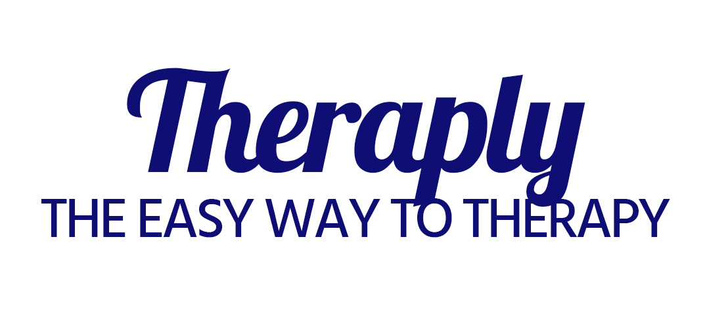
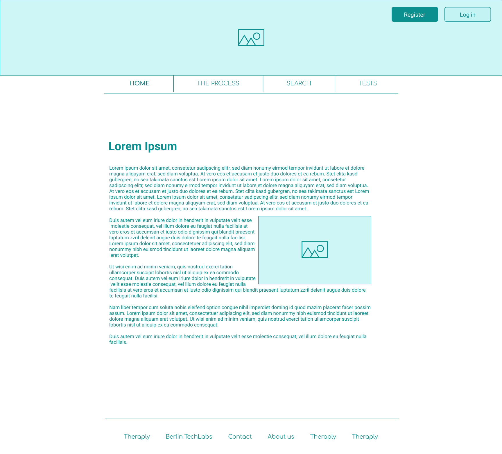
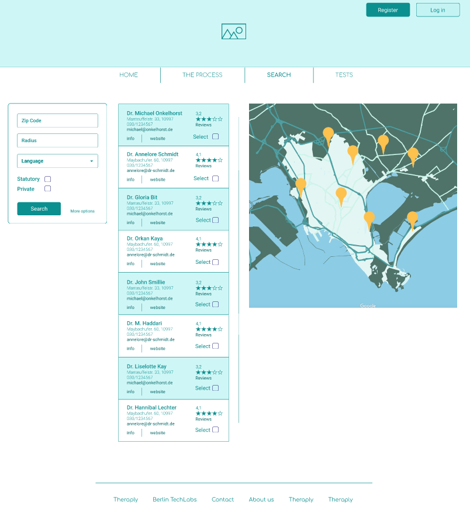
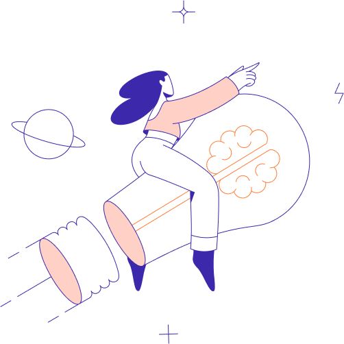
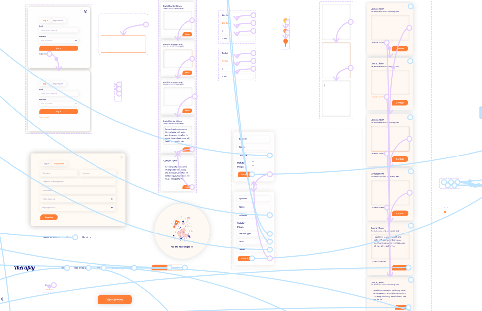
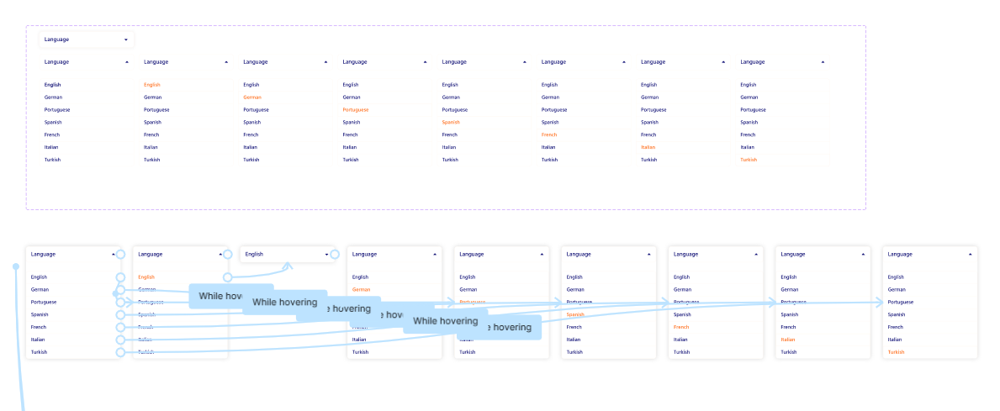
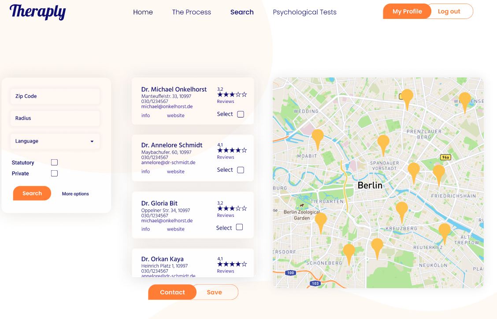
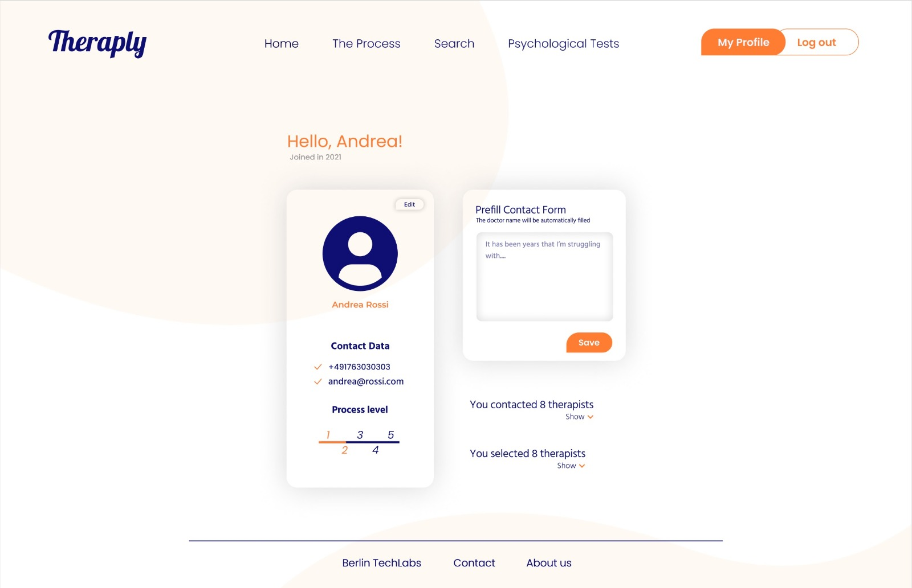
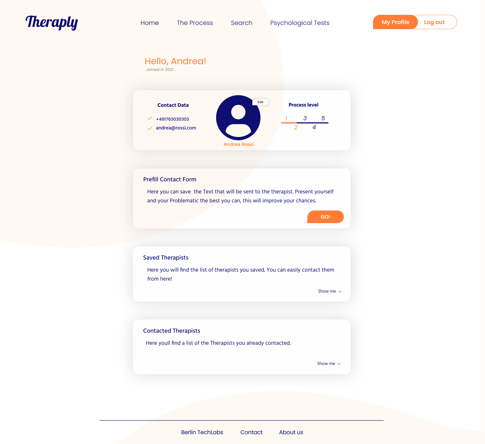

<<<<<<< HEAD

## The Idea
Finding a therapy place can be a challenging, arduous and lengthy process. Some of the key pain points faced by patients on the path to a therapy place are  the limited knowledge a (first time) patient has about the process, it’s complexity and multi-layeredness and finally it’s lengthiness. This can be frustrating and complicates mental health efforts for those who have managed to take the step of seeking therapy in the first place.
The idea of Theraply was developed to create a helpful instrument to ease this process. It is full-stack application aimed at simplifying the process of finding a therapy place and supporting patients on their path by tackling the common pain points faced by patients on their journey. By offering a single point of information in form of a website with a clear overview of the process, Theraply aims to ease these challenges. It is designed to guide and motivate users through the steps entailed in the process and provides a way to easily find and contact the therapists they need through the use of filters, ratings and easy-to-use pre-filled forms, helping them during the search and contact stage. Lastly, Theraply also supports users to document their efforts by keeping track of contact inquiries, responses, confirmations, rejections and 'non-responses.

## UX Track
### The Basics

From the very beginning we started brainstorming to decide which would be the basics functionalities of the Webpage. What was very important to have and what less, keeping in mind that if time allows we would develop all of them.  

The Core Functionalities are:
- A process overview
- A tracking system that shows the users at which point of the process they are
- Different search filters
- Search results showing ratings for each therapist
- Possibility to contact more therapists at once
- A template to contact therapists

### The UX Process

The UX process started with the user research. Following the competition analysis and the interviews we had a clear view of who our "target audience" is and which the most important "issues" to be addressed were. 

Users can be summed up on average to 3 types: 

- The first are those who start their search and after a very complex process, find a therapist
- The second wants to start therapy but gives up after a while of searching 
- The third are those who want to start therapy but don't even begin to search because they feel unmotivated knowing the complexity of the process 

In short, everyone feels frustrated and overwhelmed.
The personas, storyboards and scenarios were thought of and created after this evaluation, Because of this and in accordance with the theme of our project,the design should be simple, clean and relaxing - Intuitive and easy to navigate.

### Wireframing

Back to brainstorming, ideas and sketches for the first basic wireframes on paper, which we then presented to the rest of the Team to give a quick idea of the direction we were going to take.The webpage will follow a hierarchical IA model, which felt the most appropriate for our webpage. 
Following the first low fidelity wireframes, we moved to Figma to create a mid fidelity wireframe, with further development of what were our first ideas on paper and some modifications. Once finished with the basics we started creating all the animated interactions and went through a lot of frustrations, videos, trial and error, headaches, more frustrations and solutions. Doing this on the mid fidelity wireframe proved to be a terrific  choice, helping us move to the next step and in many instances facilitating our work during the development of our end design.

|  |  |
| - | - | 

###### Mid fidelity wireframes of the homepage and the search page

### The new design

   
######Some of our illustrations

Moving to the final UI development, brought with itself a new and different level of obstacles and headaches. Brainstorming colours, design ideas, shapes, illustrations, fonts, misunderstandings, different tastes, wash, rinse repeat..

|  |  |
| - | - | 
###### A view of some of our interactions

We kept calm (kinda) and carried on (for sure) with loads of coffee on our side. Slowly but steadily it started getting shape. Throughout the process, it was possible to experiment with new functions, tools, ideas and designs. In general it was all very interesting and with a lot of learning, and some more headaches, when you think you finished, you try it and, on the second run 3 things stopped working.

###### Final home page and search page design

### Testing and Adjusting

We ran some user tests with our prototype in Figma. This was a little awkward for the users because of some “unnatural” behaviour of the program, (unnatural for a web page) when many interactions are present in one page. i.e. after using the search the user need to click again to close the interaction to move to the next, while in an actual webpage the interactions flow. 
Following the test evaluation, some adjustments have been made, correcting on parts that without testing  probably wouldn’t have been noticed, for example some parts of the text were too small, even in bigger screens, the menu “Tests” wasn’t as self explanatory as thought, we went therefore with “Psychological Tests”. 
With the advice from our mentor and track leader we were also able to improve some things. 

|  |   |
| - | - |

###### Profile page before and after

We found it interesting that working on one issue all of a sudden presented another one to solve,  a new insight of what we were creating  which wasn't there before emerged, which helped us understand how to procede. Likewise the opinion and advice of the users helped us determine what can be improved or modified. All of this got us wondering at a certain point why did we even do it this way. 
It was very exciting to see everything connecting and taking shape and finally, see our finished project.

## Backend
For backend development, the goals were set clearly from the beginning. The backend had to run a server from which then the frontend team’s React build could be served. In addition, a database containing the therapist data had to be created and filled to which the frontend would be able to talk and receive the necessary information. 
To run a server an index.js file was created from which a server was hosted on port localhost:8800 from which the React build was being served.
Using MongoDB and a CSV file provided by our Data scientist, a database was created and filled using the seeds.js file. Within the index.js file APIs were created that could be queried to return information about the therapists.

## Frontend Track 
We were excited to start off the project work as soon as possible and to dive into the coding process. Based on the wireframes from the UX part of our team, we started coding our very first pages of this project and were excited and looking forward to see things come to life but also humbled by the task ahead.
Along the process of coding the project and throughout the work, some themes and patterns emerged and came up repeatedly. It was noticeable that at the beginning working on the code was a little halting, but the longer one sat at it, the more the work flowed and as ones confidence grew, so did the courage to tackle things one did not yet know how to solve - often with results that surprised oneself. Finding ways to solve things one did not know how to solve at first was a big part of the process - and error-fixing. The amount of times one was confronted with error-messages and that was spent on trying to fix these resulted in the need of a newly found skill: The skill of masterfully phrasing your problem in search terms that will give you relevant results with helpful hints towards what it is that you did wrong or what it is that you missed. On that same note, another key coding-learning throughout this project was that everything takes longer than you think it will take :D. 
In retrospect, coding requires a lot of planning, logical structuring and breaking things down into smaller and smaller, more easily digestible parts that are then brought together to form the bigger picture. Besides that, coding in a multidisciplinary team (and in a team in general) benefited from a lot of communication. It was very helpful and reassuring to exchange thoughts and to ask for help or support when needed. 
Currently, we have completed the very base of our project idea. If we were to continue, we would now focus on adding more functionality and further features in a continued and iterative step by step approach.

### Kübra

During the project phase, I realized two crucial things, it is wildly different to code along or to code on your own, and also that it is deeply satisfying to be able to do so. Seeing the project slowly come alive was a thrilling experience. Also, I learned that coding takes time. 

“Oh, a simple button surely won’t take long right? Wrong!”

 

##### Progess of the registration form

Sometimes I was shocked about the amount of time it took me to solve a seemingly easy task. 
While working on the frontend code I heavily focused on the UI, trying desperately to make everything look like our designers have imagined them. I am a very visual person and I truly enjoy beautiful design, so I was quite driven to match everything to a tea. By doing so I failed to consider that the page actually needs to function as well. That arguably obvious fact took me almost an embarrassing time to realize. 
At the same time, with almost a childlike glee, I saw that step by step I was able to perform tasks and the code with more comfort plus a plan of what I wanted to do. 
I mainly was responsible for creating the registration form and also the home page/landing page. I wished I would have been able to accomplish more in the time given to us. If I learned anything I would like to pick up the pace in which I make progress and also be able to research quicker and better solutions for the challenges I face during coding. I also struggled with creating responsive sites and I definitely feel like that’s an aspect that is still lacking in my code. 
If anything, the whole project motivates me to keep learning and growing as a beginner coder. Despite the challenges I faced during the project I was also immensely grateful for our team. I experienced the communication as quick, transparent, and direct in a respectful and kind way. I think everybody did great work and I’m truly inspired by seeing the growth and drive of everyone involved! Additionally, I was thankful for our mentor Nik as well. I had the impression that I was able to gain insight into what working in the tech world would look like and how to organize ourselves. Of course, the feedback was helpful too!
Overall, I’m glad that I was able to take the course at TechLabs Berlin. :) 

 

##### Progress of the landing page

Tika - DS

In the middle of the hectic last minutes of fixing and revising the data science part of our project, I took time today to sit down for a bit and reflect on the last four months. Time runs so fast, that without fully realizing it, it is now almost the end of the semester. I enjoyed the chill and self-paced, self-study periods when I was so awed by how new everything to me was. Learning Python was (and is!) like learning a new language and a new mindset, it opens up a whole different world to me, that I never really knew before. I have always been more of a humanities and social sciences person. 

Not long after finishing the last few modules of the DS track, then came the project phase, and to me, it felt so different from self-study. It gave me more freedom and room for creativity, but at the same time also way more challenging, hectic, and somewhat lonely. The hard part was not really about who should I ask for help, because people are helpful at Techlabs, but which questions I should ask. It was confusing enough, and sometimes I felt lost in my own problems, though the mentor and the weekly meetings with my teammates helped tremendously. I still have huge insecurity when it comes to my work so far, but now I kind of starting to accept that it is the way people learn and keep on learning how to code and program: by making a lot of mistakes and plan Bs.

There were things that I had initially planned for our app but didn’t finalize at the end, however, on the other hand, there were also a lot of plan Bs, and many new ideas that came up during the bittersweet moments of working together with the group on Theraply. The idea I had in mind was to look for a dataset related to therapists in Berlin, like a useful list of therapists, metadata of people who are looking for therapy, and so on. However, it was impossible to find open public datasets that are relevant, so I had to generate my own dataset for the backbone of Theraply from scraping here and there. I also had some try-out moments with different platforms and websites to make use of API for data scraping. In the end, what I did on our project were: 1. generated a dataset of therapists list with contacts and waiting time estimation; 2. made data visualizations and analysis based on it; 3. made an algorithm with sklearn to map the data and suggest similar therapist; 4. made use of Flask and generated a user mock data with random package for data proofing the user selection based-prediction of success rate in contacting therapists and how long the users have to wait for the first appointment with one of the therapists. I wanted to scrap ratings for each therapists with google maps API at first, but there were a lot of obstacles in finding each therapist on google maps and also the time to do everything was very short. This could be a potential development for the app in the future.

In retrospect, I had a nice, exciting, and definitely challenging time during the semester with Techlabs. Juggling learning coding, building a prototype for an app, and working full time was not the easiest, but all the ups and downs and the gain make it worth it. I am looking forward to continuing learning, perfecting my skills, and experimenting with other projects in the future.

>>>>>>> 1fc3f50cb078d0c305a72873749d0aead26f238b
